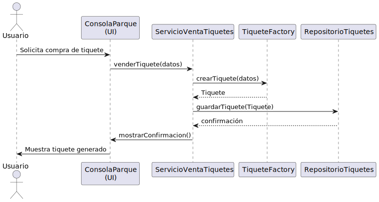
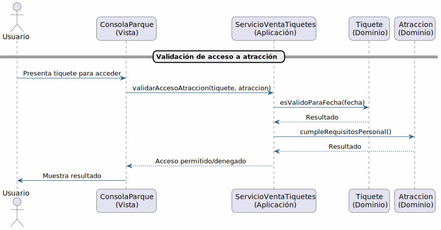
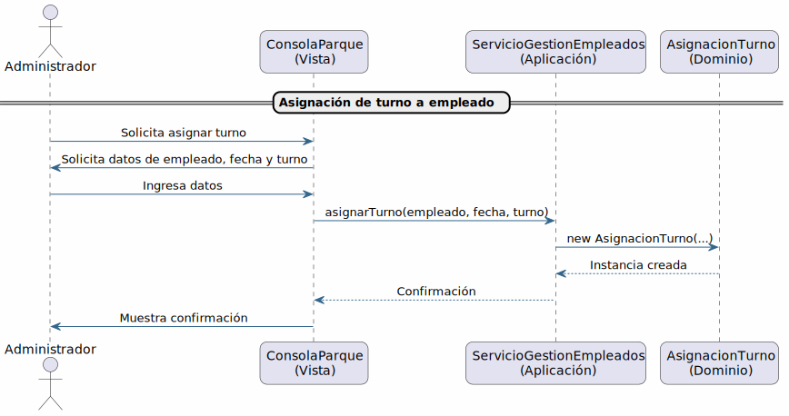
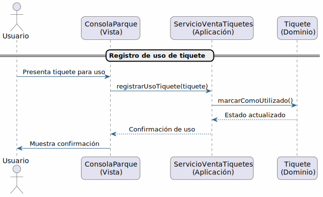
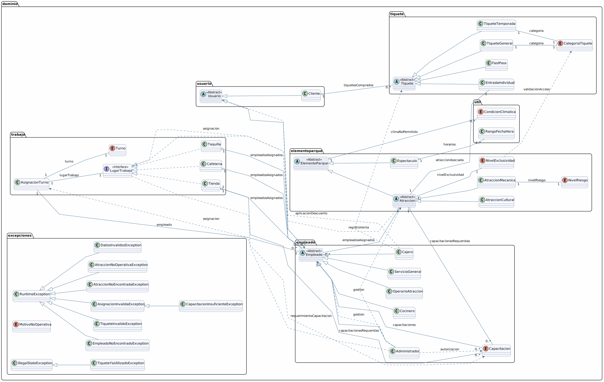
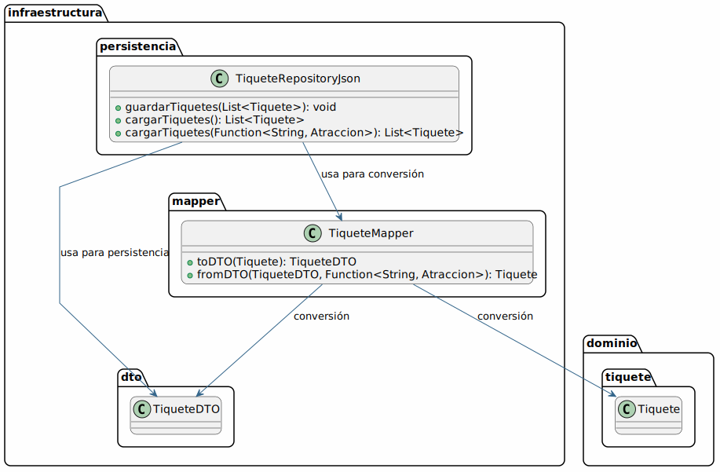
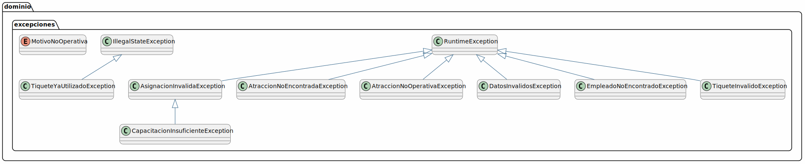
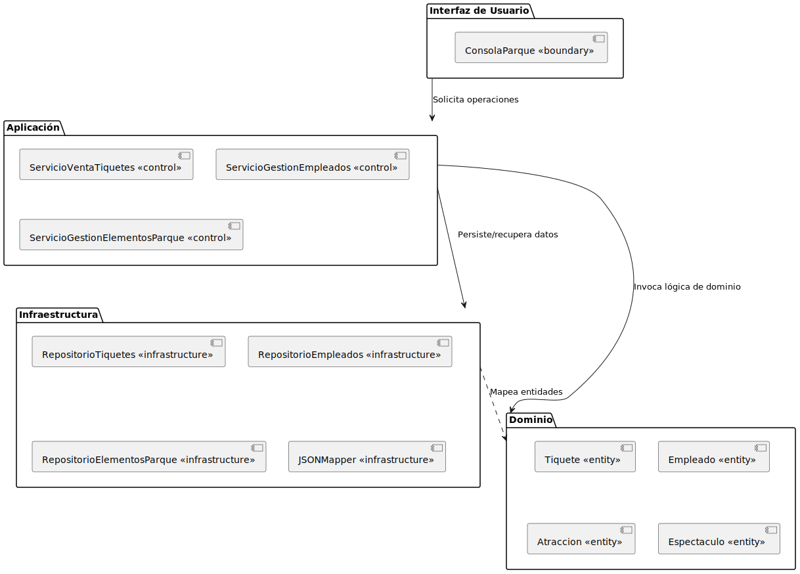
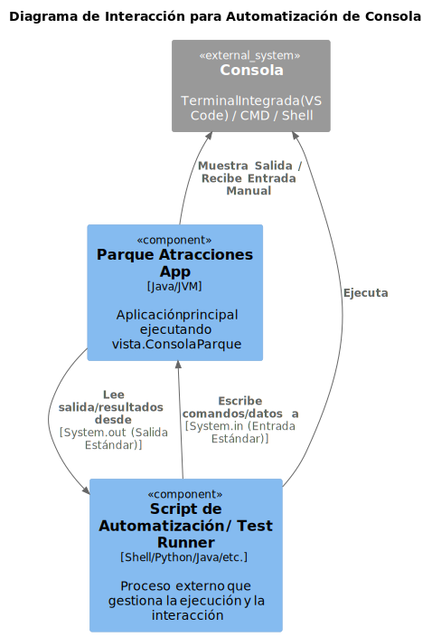

# DOCUMENTO DE DISEÑO DEL SISTEMA: PARQUE DE ATRACCIONES

**Filosofía de Diseño:** Este documento busca no solo presentar el diseño final del sistema del Parque de Atracciones, sino también ilustrar el *proceso* gradual e iterativo mediante el cual se llegó a él. El objetivo es **lograr consenso**, **compartir conocimiento** sobre las decisiones tomadas y asegurar que se consideran los aspectos importantes. Seguiremos un enfoque paso a paso, comenzando por la comprensión del problema, identificando roles y responsabilidades clave, y refinando la estructura progresivamente. Las decisiones de diseño se justificarán utilizando principios como la **reducción de complejidad**, la **previsión de cambios futuros**, el **bajo acoplamiento**, la **alta cohesión** y la **asignación cuidadosa de responsabilidades**, haciendo referencia a metodologías y patrones cuando sea apropiado. El diagrama de clases completo, resultado de este proceso, se presentará al final como culminación del razonamiento.

## Índice rápido

- [1. Contexto y Objetivos](#1-comprensión-del-problema-contexto-objetivos-y-restricciones)
- [2. Análisis Detallado del Dominio y Requerimientos](#2-análisis-detallado-del-dominio-y-requerimientos)
- [3. Roles y Responsabilidades](#3-identificación-inicial-roles-responsabilidades-y-conceptos-clave)
- [4. Diseño Arquitectónico y Estereotipos](#4-diseño-basado-en-responsabilidades-rdd-y-estructura-arquitectónica)
- [5. Consideraciones de Diseño](#5-consideraciones-de-diseño-y-principios-aplicados-análisis-detallado)
- [6. Diagrama de Clases](#6-diseño-detallado-el-diagrama-de-clases-resultante)
- [7. Persistencia y Excepciones](#7-detalles-adicionales-persistencia-y-manejo-de-excepciones)
- [8. Interacción con la Consola](#8-ejecución-e-interacción-con-la-consola)
- [Glosario](#glosario)

## 1. Comprensión del Problema: Contexto, Objetivos y Restricciones

### 1.1. Contexto
El sistema debe gestionar la operación diaria de un parque temático. Esto incluye el manejo de atracciones (sus tipos, estados, requisitos), los empleados que las operan (sus roles, capacitaciones, asignaciones), la venta y control de tiquetes para los visitantes (tipos, validaciones, uso), y la adaptación a diversas condiciones operativas (clima, mantenimiento, eventos especiales). Además, el parque cuenta con otros elementos como espectáculos, cafeterías, tiendas y taquillas que deben coexistir dentro del sistema, aunque su gestión detallada pueda variar en profundidad.

**Restricciones y Supuestos Iniciales:**
*   **Persistencia:** La información se almacenará y recuperará utilizando archivos en formato JSON. Esto implica diseñar mecanismos de serialización/deserialización.
*   **Interfaz:** La interacción principal con los usuarios (administradores, taquilleros) se realizará a través de una interfaz por consola.
*   **Alcance:** El foco inicial está en las operaciones centrales: tiquetes, personal esencial y operación de atracciones.

### 1.2. Objetivos Principales del Sistema (Requerimientos Funcionales Clave)
*   **Gestión de Tiquetes:** Permitir la compra (considerando tipos de usuario, posibles descuentos) y la validación de tiquetes para el acceso a atracciones o eventos. Registrar el uso efectivo de un tiquete.
*   **Gestión de Personal:** Administrar la información de los empleados (datos básicos, roles), sus capacitaciones específicas (qué atracciones/tareas pueden realizar) y sus asignaciones a turnos y lugares de trabajo.
*   **Gestión de Elementos del Parque:** Controlar el estado operativo de las atracciones (abierta, cerrada, en mantenimiento, requisitos de personal) basándose en factores como el clima, la seguridad y la disponibilidad de personal capacitado. Registrar información básica de otros elementos (espectáculos, tiendas).
*   **Operación Diaria:** Orquestar los flujos básicos como la apertura/cierre del parque, la asignación de personal al inicio del día, y la verificación de condiciones operativas.

### 1.3. No-Objetivos (Delimitación del Alcance Inicial)
Para **reducir la complejidad inicial** y enfocarnos en el núcleo, explícitamente dejamos fuera:
*   Interfaces gráficas de usuario (GUI) o web.
*   Integración en tiempo real con sistemas de pago externos.
*   Gestión detallada de inventarios (tiendas, cafeterías).
*   Sistemas complejos de reservas online o planificación avanzada de visitas.
*   Autenticación robusta o gestión de sesiones complejas (más allá de identificar tipos de usuario).

*(Estos no-objetivos son cruciales para mantener el diseño manejable y sostenible en las primeras iteraciones)*.

### 1.4. Consideraciones No Funcionales (Preliminares)
Aunque no se detallan exhaustivamente ahora, tenemos en mente:
*   **Mantenibilidad:** El diseño debe ser fácil de entender y modificar (**diseño sostenible**).
*   **Extensibilidad:** Debe ser relativamente sencillo añadir nuevos tipos de atracciones, tiquetes o reglas de negocio en el futuro (**pensar en los cambios**).
*   **Robustez:** El sistema debe manejar errores esperados (ej. tiquete inválido, empleado no capacitado) de forma controlada.

## 2. Análisis Detallado del Dominio y Requerimientos

### 2.1. Glosario de Términos Clave

#### Elementos del Parque (Paquete: `dominio.elementoparque`)
**ElementoParque:** Clase base abstracta para atracciones y espectáculos.
*Atributos:* id (String), nombre (String), cupoMaximo (int), esDeTemporada (boolean), fechaInicioTemporada (LocalDateTime), fechaFinTemporada (LocalDateTime), climaNoPermitido (List<CondicionClimatica>).

**Atraccion:** Clase base abstracta para atracciones mecánicas y culturales. Hereda de `ElementoParque` e implementa `LugarTrabajo`.
*Atributos:* ubicacion (String), empleadosMinimos (int), empleadosAsignados (List<Empleado>), nivelExclusividad (NivelExclusividad), capacitacionesRequeridas (Set<Capacitacion>).

**AtraccionMecanica:** Tipo de atracción con maquinaria. Hereda de `Atraccion`.
*Atributos:* nivelRiesgo (NivelRiesgo), restriccionAlturaMinima (double), restriccionAlturaMaxima (double), restriccionPesoMinimo (double), restriccionPesoMaximo (double), contraindicacionesSalud (List<String>), restriccionesSalud (List<String>), capacitacionEspecifica (Capacitacion).

**AtraccionCultural:** Tipo de atracción interactiva o de exhibición. Hereda de `Atraccion`.
*Atributos:* edadMinima (int).

**Espectaculo:** Evento en vivo. Hereda de `ElementoParque`.
*Atributos:* descripcion (String), horarios (List<RangoFechaHora>), ubicacion (String, lugar donde se realiza).

**NivelExclusividad:** Enum (FAMILIAR, ORO, DIAMANTE). Determina el acceso a atracciones.

**NivelRiesgo:** Enum (MEDIO, ALTO). Clasifica el riesgo de atracciones mecánicas.

#### Usuarios y Empleados (Paquetes: `dominio.usuario`, `dominio.empleado`)
**Usuario:** Clase base abstracta para clientes y empleados.
*Atributos:* identificacion (String), nombre (String), email (String), telefono (String), username (String), password (String).

**Cliente:** Usuario externo del parque. Hereda de `Usuario`.
*Atributos:* fechaNacimiento (LocalDate), altura (double), peso (double), condicionesMedicas (List<String>), tiquetesComprados (List<Tiquete>).

**Empleado:** Clase base abstracta para el personal del parque. Hereda de `Usuario`.
*Atributos:* capacitaciones (Set<Capacitacion>).

**Administrador:** Empleado con permisos administrativos. Hereda de `Empleado`.
*Atributos:* areasResponsabilidad (List<String>).

**Cajero:** Empleado para ventas y caja. Hereda de `Empleado`.
*Atributos:* cajaAsignada (int), puntoVenta (String).

**Cocinero:** Empleado para preparación de alimentos. Hereda de `Empleado`.
*Atributos:* especialidad (String).

**OperarioAtraccion:** Empleado para operar atracciones. Hereda de `Empleado`.
*Atributos:* certificadoSeguridad (boolean), atraccionesHabilitadas (List<String>), disponible (boolean).

**ServicioGeneral:** Empleado para tareas generales. Hereda de `Empleado`.

**Capacitacion:** Enum que representa habilidades específicas requeridas (ej. OPERACION_ATRACCION_RIESGO_ALTO, PRIMEROS_AUXILIOS, MANEJO_CAJA).

#### Trabajo (Paquete: `dominio.trabajo`)
**LugarTrabajo:** Interfaz que representa un sitio donde se asigna un empleado (Implementada por `Atraccion`, `Cafeteria`, `Tienda`, `Taquilla`). Define métodos para asignación y verificación.

**Cafeteria:** Lugar de trabajo específico. Implementa `LugarTrabajo`.
*Atributos:* nombre (String), empleadosRequeridos (int), empleadosAsignados (List<Empleado>).

**Taquilla:** Lugar de trabajo específico para venta de tiquetes. Implementa `LugarTrabajo`.
*Atributos:* nombre (String), empleadosRequeridos (int), empleadosAsignados (List<Empleado>).

**Tienda:** Lugar de trabajo específico para venta de mercancía. Implementa `LugarTrabajo`.
*Atributos:* nombre (String), maximoEmpleados (int), empleadosAsignados (List<Empleado>), capacitacionesRequeridas (Set<Capacitacion>).

**AsignacionTurno:** Representa la asignación de un empleado a un lugar y turno específicos.
*Atributos:* id (String), empleado (Empleado), lugarTrabajo (LugarTrabajo), fecha (LocalDate), turno (Turno).

**Turno:** Enum (APERTURA, CIERRE). Define los dos períodos de trabajo diarios.

#### Tiquetes (Paquete: `dominio.tiquete`)
**Tiquete:** Clase base abstracta para los diferentes tipos de tiquetes.
*Atributos:* codigo (String), fechaHoraEmision (LocalDateTime), precio (double), utilizado (boolean), identificacionComprador (String), nombreComprador (String), descuentoEmpleado (boolean).

**TiqueteGeneral:** Tiquete de acceso al parque y atracciones según categoría. Hereda de `Tiquete`.
*Atributos:* categoria (CategoriaTiquete), fechaActivacion (LocalDateTime).

**TiqueteTemporada:** Tiquete de acceso durante un período. Hereda de `Tiquete`.
*Atributos:* categoria (CategoriaTiquete), fechaInicio (LocalDateTime), fechaFin (LocalDateTime), utilizado (boolean, con lógica específica).

**EntradaIndividual:** Tiquete para un único acceso a una atracción específica. Hereda de `Tiquete`.
*Atributos:* atraccionAsociada (Atraccion), codigoUnico (String).

**FastPass:** Tiquete para acceso prioritario en una fecha específica. Hereda de `Tiquete`.
*Atributos:* fechaValida (LocalDateTime).

**CategoriaTiquete:** Enum (BASICO, FAMILIAR, ORO, DIAMANTE). Define el nivel de acceso.

#### Utilidades y Excepciones (Paquetes: `dominio.util`, `dominio.excepciones`)
**CondicionClimatica:** Enum (TORMENTA, LLUVIA_FUERTE, FRIO_EXTREMO, CALOR_EXTREMO, VIENTO_FUERTE, NORMAL). Usado en `ElementoParque`.

**RangoFechaHora:** Clase utilitaria para representar un intervalo de tiempo.
*Atributos:* inicio (LocalDateTime), fin (LocalDateTime).

**Excepciones:** Clases específicas para manejar errores (ej. `AsignacionInvalidaException`, `AtraccionNoOperativaException`, etc.).

**MotivoNoOperativa:** Enum (CLIMA_INVALIDO, FALTA_PERSONAL). Usado por `AtraccionNoOperativaException`.

#### Otros Conceptos Derivados del Modelo
**DescuentoEmpleado:** Concepto aplicado en la compra, reflejado en `Tiquete`.
**Restricciones:** Condiciones que limitan el acceso (altura, peso, salud, edad, clima).
**Temporada:** Período de operación controlado por atributos en `ElementoParque`.
**Validacion de Tiquete:** Proceso de verificar aptitud, involucra métodos como `esValidoParaFecha`, `isUtilizado`, `marcarComoUtilizado`.

### 2.2. Requerimientos Funcionales del Sistema (Casos de Uso)

#### 2.2.1. Gestión de Elementos del Parque (Atracciones y Espectáculos)
**CU-01: Crear Atracción Mecánica**
*Actor Principal:* Administrador
*Descripción:* Registrar nueva atracción mecánica con ID, nombre, ubicación, cupo, empleados mínimos, nivel exclusividad, nivel riesgo, restricciones (altura, peso, salud), condiciones climáticas, y capacitación específica si riesgo Alto.
*Historia de Usuario:* Como administrador, quiero registrar atracciones mecánicas con toda la información relevante y restricciones, para asegurar su correcta operación y seguridad.

**CU-02: Crear Atracción Cultural**
*Actor Principal:* Administrador
*Descripción:* Registrar nueva atracción cultural con ID, nombre, ubicación, cupo, empleados mínimos, edad mínima, condiciones climáticas y nivel exclusividad.
*Historia de Usuario:* Como administrador, quiero registrar atracciones culturales con sus características y restricciones, para gestionar adecuadamente la oferta del parque.

**CU-03: Crear Espectáculo**
*Actor Principal:* Administrador
*Descripción:* Registrar nuevo espectáculo con ID, nombre, descripción, ubicación (general), lista de horarios, y condiciones climáticas. No requieren empleados directos ni nivel de exclusividad.
*Historia de Usuario:* Como administrador, quiero registrar espectáculos con su información, horarios y restricciones, para ofrecer entretenimiento variado en el parque.

**CU-04: Consultar Elementos del Parque**
*Actor Principal:* Administrador, Empleado, Cliente
*Descripción:* Consultar información detallada de atracciones y espectáculos (por ID, nombre, o listando por tipo). Muestra características, restricciones, horarios.
*Historia de Usuario:* Como usuario, quiero consultar la información de atracciones y espectáculos, para conocer la oferta y características del parque.

**CU-05: Actualizar Información de Atracción**
*Actor Principal:* Administrador
*Descripción:* Modificar información de una atracción (cupo, empleados mínimos, restricciones, etc.). No se permite cambiar ID.
*Historia de Usuario:* Como administrador, quiero poder actualizar la información de las atracciones, para mantener los datos al día y garantizar la correcta gestión.

**CU-06: Definir Temporada de Elemento**
*Actor Principal:* Administrador
*Descripción:* Definir o actualizar el período de disponibilidad (rango de fechas) para atracciones o espectáculos de temporada.
*Historia de Usuario:* Como administrador, quiero definir o modificar el período de operación de atracciones y espectáculos, para gestionar su disponibilidad según la temporada.

#### 2.2.2. Gestión de Empleados y Labores
**CU-07: Registrar Empleado**
*Actor Principal:* Administrador
*Descripción:* Registrar nuevo empleado especificando tipo (Admin, Operario, Cajero, Cocinero, ServicioGeneral) y datos personales/autenticación. Añadir capacitaciones iniciales.
*Historia de Usuario:* Como administrador, quiero registrar empleados con sus datos y rol, para gestionar el personal del parque de forma eficiente.

**CU-08: Consultar Información de Empleado**
*Actor Principal:* Administrador
*Descripción:* Buscar empleado por ID o listar todos, visualizando información básica y capacitaciones.
*Historia de Usuario:* Como administrador, quiero consultar la información y capacitaciones de los empleados, para controlar y gestionar adecuadamente el personal.

**CU-09: Asignar Turno a Empleado**
*Actor Principal:* Administrador
*Descripción:* Asignar empleado a turno (apertura/cierre) en fecha determinada, a un Lugar de Trabajo (Atracción, Cafetería, Tienda, Taquilla) o Servicio General. Valida capacitaciones y conflictos horarios.
*Historia de Usuario:* Como administrador, quiero asignar turnos a los empleados en los lugares de trabajo, validando sus capacitaciones y disponibilidad, para asegurar una operación eficiente y segura.

**CU-10: Consultar Asignaciones Propias**
*Actor Principal:* Empleado
*Descripción:* Empleado consulta sus asignaciones de turnos para un día específico (fecha, turno, lugar de trabajo, tarea general).
*Historia de Usuario:* Como empleado, quiero consultar mis asignaciones de turno para un día, para organizar mi trabajo y responsabilidades.

**CU-11: Consultar Asignaciones Generales**
*Actor Principal:* Administrador
*Descripción:* Administrador consulta todas las asignaciones de turnos para una fecha, o filtra las de un empleado particular para un día.
*Historia de Usuario:* Como administrador, quiero consultar las asignaciones de turnos por fecha o por empleado, para supervisar y planificar la operación del parque.

**CU-12: Autorizar Capacitación a Empleado**
*Actor Principal:* Administrador
*Descripción:* Registrar que un empleado ha adquirido una nueva capacitación (ej. Primeros Auxilios, Operación de Atracción Específica).
*Historia de Usuario:* Como administrador, quiero registrar nuevas capacitaciones para empleados, para asegurar que el personal cumple los requisitos de operación.

**CU-13: Verificar Cumplimiento de Personal**
*Actor Principal:* Administrador
*Descripción:* Verificar si un Lugar de Trabajo específico cumple requisitos mínimos de personal (cantidad, roles/capacitaciones) para un turno y fecha, basado en asignaciones. Informa si puede operar.
*Historia de Usuario:* Como administrador, quiero verificar si un lugar de trabajo cumple los requisitos de personal para operar, para garantizar la seguridad y el servicio adecuado.

#### 2.2.3. Venta de Tiquetes
**CU-14: Vender Tiquete General**
*Actor Principal:* Cajero (en Taquilla), Cliente (en línea)
*Actor Secundario:* Empleado (como comprador con descuento)
*Descripción:* Venta de tiquetes de acceso general al parque (categorías Básico, Familiar, Oro, Diamante), sin fecha específica. Descuento a empleados.
*Historia de Usuario:* Como cajero o cliente, quiero comprar tiquetes generales para ingresar al parque, y como empleado, quiero adquirirlos con descuento.

**CU-15: Vender Tiquete de Temporada**
*Actor Principal:* Cajero (en Taquilla), Cliente (en línea)
*Actor Secundario:* Empleado (como comprador con descuento)
*Descripción:* Venta de tiquetes de acceso ilimitado por rango de fechas (categorías Familiar, Oro, Diamante, no Básico). Descuento a empleados.
*Historia de Usuario:* Como cajero o cliente, quiero comprar tiquetes de temporada para acceder ilimitadamente, y como empleado, con descuento.

**CU-16: Vender Entrada Individual**
*Actor Principal:* Cajero (en Taquilla), Cliente (en línea)
*Actor Secundario:* Empleado (como comprador con descuento)
*Descripción:* Venta de entrada para acceso único a atracción específica (mecánica o cultural), válida cualquier día operativo. Descuento a empleados.
*Historia de Usuario:* Como cajero o cliente, quiero comprar entradas individuales para una atracción específica, y como empleado, con descuento.

**CU-17: Vender FastPass**
*Actor Principal:* Cajero (en Taquilla), Cliente (en línea)
*Descripción:* Venta de FastPass para un día específico, permite acceso prioritario. (Implementación detallada pendiente en código base).
*Historia de Usuario:* Como cajero o cliente, quiero comprar un FastPass para un día específico, para agilizar mi acceso.

**CU-18: Validar Tiquete**
*Actor Principal:* Cajero (en atracción/entrada), Sistema
*Descripción:* Verificar validez de tiquete (categoría/exclusividad, vigencia de temporada, uso previo para entrada individual/general). Marcar como utilizado.
*Historia de Usuario:* Como cajero o sistema, quiero validar la autenticidad y vigencia de los tiquetes, para garantizar acceso correcto y evitar fraudes.

**CU-19: Consultar Tiquetes Propios**
*Actor Principal:* Cliente, Empleado
*Descripción:* Usuario registrado (Cliente o Empleado) consulta su lista de tiquetes adquiridos.
*Historia de Usuario:* Como cliente o empleado, quiero consultar los tiquetes que he adquirido, para revisar mis compras y accesos disponibles.

### 2.3. Documentación de Reglas de Dominio

#### 2.3.1. Reglas sobre Atracciones y Espectáculos
*   Tipos de Elementos: Atracciones Mecánicas, Atracciones Culturales, Espectáculos.
*   Ubicación:
    *   Atracciones (Mecánicas y Culturales): ubicación fija.
    *   Espectáculos: no fija, según horarios.
*   Capacidad y Personal:
    *   Atracciones: cupo máximo de visitantes y número mínimo de empleados requeridos.
    *   Una atracción no opera sin el mínimo de personal asignado y presente.
    *   Espectáculos: tercerizados, no requieren empleados del parque.
*   Restricciones (Atracciones Mecánicas):
    *   Límites de altura (min/max) y peso (min/max).
    *   Contraindicaciones de salud específicas.
    *   Otras restricciones (ej. discapacidades).
    *   Nivel de Riesgo (Medio o Alto).
*   Restricciones (Atracciones Culturales):
    *   Restricción de edad mínima (0 si no aplica).
*   Restricciones Climáticas:
    *   Atracciones y Espectáculos pueden tener lista de condiciones climáticas no operativas.
*   Exclusividad (Atracciones):
    *   Cada Atracción tiene Nivel de Exclusividad (Familiar, Oro, Diamante).
    *   Este nivel determina qué categoría de Tiquete General/Temporada permite acceso.
*   Espectáculos no tienen Nivel de Exclusividad.
*   Temporalidad:
    *   Algunos elementos pueden ser "de temporada" (operan en rango de fechas específico).
    *   Si no es de temporada, se asume disponible todo el año (sujeto a otras restricciones).
*   Administración: Administrador es el único rol para crear/modificar/eliminar información de atracciones/espectáculos.
*   Consulta: Clientes, Empleados y Administradores pueden consultar información.

#### 2.3.2. Reglas sobre Empleados y Asignaciones
*   Tipos de Empleados: Administrador, Operario de Atracción, Cajero, Cocinero, Servicio General.
*   Lugares de Trabajo: Atracciones (Mecánicas/Culturales), Lugares de Servicio (Cafeterías, Tiendas, Taquillas), Servicio General (sin lugar fijo).
*   Requisitos de Personal en Lugares de Servicio:
    *   Cada Lugar de Servicio (Cafetería, Tienda, Taquilla) debe tener al menos un Cajero asignado por turno.
    *   Cafeterías, además, deben tener Cocineros asignados.
    *   Cocineros deben tener capacitación "Manejo de Alimentos".
    *   Un Cocinero puede cubrir puesto de Cajero si es necesario.
    *   Un empleado sin rol Cocinero (y sin capacitación) no puede trabajar en cocina.
*   Requisitos de Personal en Atracciones Mecánicas:
    *   Solo operadas por Operario de Atraccion con capacitaciones adecuadas.
    *   Atracciones Riesgo Medio: cualquier Operario con capacitación genérica de operación.
    *   Atracciones Riesgo Alto: solo Operarios con capacitación específica para esa atracción. Un operario para riesgo alto A no opera riesgo alto B sin esa capacitación específica.
    *   Un empleado puede estar capacitado para múltiples atracciones (riesgo medio/alto).
*   Asignación de Turnos:
    *   Administrador responsable de asignar.
    *   Dos turnos diarios: Apertura y Cierre.
    *   Empleado puede ser asignado a uno o ambos turnos en un día.
    *   Asignación respeta capacitaciones requeridas.
    *   Empleado no puede tener dos asignaciones conflictivas (mismo turno y día).
*   Consulta de Asignaciones:
    *   Empleados consultan sus propias asignaciones del día.
    *   Administrador consulta todas por fecha o empleado.
*   Operatividad de Atracciones/Lugares: Un lugar de trabajo solo opera si cumple requisitos mínimos de personal (cantidad, roles/capacitaciones) según asignaciones para ese turno.

#### 2.3.3. Reglas sobre Tiquetes y Acceso
*   Tipos de Tiquetes: Tiquete General, Tiquete de Temporada, Entrada Individual, FastPass.
*   Acceso con Tiquete General:
    *   Permite entrada al parque.
    *   Acceso a atracciones depende de categoría del tiquete y exclusividad de atracción:
        *   Básico: Solo entrada al parque, sin acceso a atracciones con exclusividad.
        *   Familiar: Acceso a atracciones de exclusividad Familiar.
        *   Oro: Acceso a atracciones de exclusividad Familiar y Oro.
        *   Diamante: Acceso a todas las atracciones (Familiar, Oro, Diamante).
    *   No tienen fecha asociada, se vuelven válidos y se marcan como "utilizados" al primer ingreso/uso.
    *   Un Tiquete General utilizado no puede reusarse para ingresar al parque o acceder a una atracción por primera vez.
*   Acceso con Tiquete de Temporada:
    *   Acceso ilimitado al parque y atracciones de su categoría (Familiar, Oro, Diamante) durante rango de fechas.
    *   No existe Tiquete de Temporada categoría Básica.
    *   Más económicos que tiquetes diarios para el mismo período.
*   Acceso con Entrada Individual:
    *   Un único acceso a la atracción específica comprada.
    *   Válido cualquier día/momento que la atracción esté operativa.
    *   Se marca como "utilizado" después del acceso.
    *   Permite acceder a atracción de exclusividad superior a la del Tiquete General del visitante.
*   Acceso con FastPass:
    *   Acceso prioritario a atracciones.
    *   Se compra para día específico.
    *   Independiente del tipo de tiquete de entrada.
*   Venta de Tiquetes:
    *   En línea (Clientes/Empleados registrados) o Taquillas (Cajeros).
    *   Al vender, no es necesario verificar restricciones (edad, altura, peso); responsabilidad del personal en atracción.
*   Prevención de Fraude: Sistema debe identificar tiquetes (General/Individual) ya utilizados.
*   Descuento para Empleados: Empleados registrados (incl. Administradores) reciben descuento porcentual.
*   Validación en Atracción: Personal (Cajero en atracción) valida tiquete (tipo, categoría/exclusividad, validez temporal, estado de uso) antes de permitir acceso.

## 3. Identificación Inicial: Roles, Responsabilidades y Conceptos Clave

En esta fase exploratoria, identificamos los elementos fundamentales del dominio y las tareas principales que el sistema debe realizar, sin asignarlas aún a componentes específicos.

### 3.1. Conceptos Clave del Dominio (Entidades Potenciales)
*   Parque
*   ElementoParque (Generalización para Atracción, Espectáculo, Tienda, Cafetería, Taquilla)
*   Atracción
*   Empleado
*   Tiquete
*   Usuario/Cliente (Comprador/Visitante)
*   Turno/AsignaciónTrabajo
*   Capacitacion
*   CondicionOperativa (Clima, Mantenimiento, Seguridad)
*   RegistroUsoTiquete

### 3.2. Actores y Roles Principales
*   **Visitante/Cliente:** Interactúa para comprar tiquetes y usarlos en atracciones/servicios.
*   **Empleado (Operador):** Opera una atracción específica, realiza validaciones de tiquetes en el punto de acceso.
*   **Empleado (Taquillero):** Interactúa con el sistema para vender tiquetes a los clientes.
*   **Empleado (Supervisor/Administrador):** Gestiona datos de empleados, asigna turnos, supervisa el estado operativo general, gestiona excepciones.
*   **Sistema (Aplicación):** Orquesta los procesos, almacena y recupera información, aplica reglas de negocio, interactúa con la persistencia.

### 3.3. Responsabilidades Generales del Sistema (Tareas a Realizar)
*(Usamos descripciones **precisas** y evitamos verbos vagos como "manejar" o "gestionar" siempre que sea posible)*
*   Registrar y consultar información detallada de atracciones (tipo, capacidad, requisitos, estado).
*   Registrar y consultar información de empleados (datos personales, rol, capacitaciones asociadas).
*   Calcular el precio de un tiquete basado en tipo, cliente y promociones vigentes.
*   Emitir (crear y persistir) un nuevo tiquete con un identificador único.
*   Verificar la validez de un tiquete (fecha, tipo, si ya fue usado) para un acceso específico.
*   Marcar un tiquete como utilizado al acceder a una atracción/evento.
*   Crear y asignar turnos de trabajo a empleados para lugares específicos (atracciones, taquillas).
*   Verificar si un empleado posee la capacitación requerida para operar una atracción o realizar una tarea.
*   Evaluar y actualizar el estado operativo de una atracción (considerando personal asignado, condiciones climáticas, estado de mantenimiento).
*   Cargar el estado del parque desde la persistencia al iniciar.
*   Guardar el estado actual del parque a la persistencia periódicamente o al cerrar.
*   Informar errores de forma clara (ej., tiquete no válido, empleado no disponible, atracción cerrada).

*(Este listado representa el "qué" funcional. El siguiente paso es decidir el "quién" y el "cómo" dentro de la arquitectura del software)*.

## 🎢 4. Diseño Basado en Responsabilidades (RDD) y Estructura Arquitectónica

Adoptamos un enfoque basado en Responsabilidad-Driven Design (RDD) para asignar las tareas identificadas a componentes lógicos (clases/módulos). Buscamos crear un sistema donde cada componente tenga un propósito claro, encapsule su lógica interna y colabore eficazmente con otros.

### 4.1. Identificación de Roles y Asignación de Estereotipos

Para organizar el sistema y clarificar el propósito de cada parte, utilizamos estereotipos UML comunes que reflejan patrones arquitectónicos.

**Tabla-resumen de Roles y Responsabilidades**

| Componente                | Estereotipo        | Responsabilidad Principal                                 |
|---------------------------|--------------------|----------------------------------------------------------|
| Consola-Parque            | `<<boundary>>`     | Interfaz usuario, entrada/salida                         |
| ServicioVentaTiquetes     | `<<control>>`      | Orquestación venta/validación de tiquetes                |
| ServicioGestionEmpleados  | `<<control>>`      | Gestión empleados, turnos, capacitaciones                |
| ServicioGestionElementos  | `<<control>>`      | Gestión estado de atracciones y elementos                |
| Tiquete                   | `<<entity>>`       | Datos y reglas de validez de tiquete                     |
| Empleado                  | `<<entity>>`       | Datos, rol, capacitaciones                               |
| Atraccion                 | `<<entity>>`       | Estado operativo, requisitos, acceso                     |
| Repositorio*              | `<<infrastructure>>`| Persistencia de entidades (JSON, etc.)                   |
| *Factory                  | `<<factory>>`      | Creación de instancias complejas                         |
| JSONMapper                | `<<infrastructure>>`| Conversión objetos <-> JSON                              |

> **Referencia:** Para el diagrama de clases completo y relaciones, ver la [sección 6](#6-diseño-detallado-el-diagrama-de-clases-resultante).

> Para detalles y colaboradores clave, ver la tabla extendida en la sección 3.1.

**Ejemplo concreto de estereotipo aplicado:**
- La clase `ServicioVentaTiquetes` en el código Java implementa el estereotipo `<<control>>`, ya que orquesta la lógica de venta y validación de tiquetes, coordinando entidades y repositorios.

### 4.2. Colaboraciones Clave y Flujos de Control (Diagramas de Secuencia)

Los diagramas de secuencia ilustran cómo estos roles colaboran para cumplir con las responsabilidades del sistema. A continuación, se presentan algunos flujos críticos:

**1. Venta de un Tiquete:**
*   El `InterfazUsuario` captura los datos.
*   El `ServicioVentaTiquetes` orquesta: usa un `TiqueteFactory` para crear el `Tiquete` y luego lo persiste usando el `RepositorioTiquetes`.

*(Nota: Este diagrama ilustra el flujo típico de venta).*

**2. Validación de Acceso a una Atracción:**
*   Un `OperadorAtraccionUI` (o similar) inicia la validación.
*   El `ServicioVentaTiquetes` recupera el `Tiquete` y la `Atraccion` (vía `ServicioGestionElementosParque` y sus repositorios).
*   Delega la validación inicial al `Tiquete` (`esValidoPara`).
*   Si es válido, consulta a la `Atraccion` (`permiteAcceso`).
*   Si todo es correcto, marca el `Tiquete` como usado y lo guarda.

*(Nota: Este diagrama refleja la lógica observada para validar un tiquete en una atracción específica).*

**3. Asignación de Turno a un Empleado:**
*   El `InterfazUsuario` captura los detalles de la asignación.
*   El `ServicioGestionEmpleados` recupera el `Empleado` y el `ElementoParque` (Atracción).
*   Verifica si el `Empleado` está capacitado (`puedeTrabajarEn`).
*   Si es apto, usa un `TurnoFactory` para crear el `Turno` y lo persiste con `RepositorioTurnos`.

*(Nota: Diagrama basado en el flujo esperado para asignar un empleado a un turno).*

**4. Registrar Uso de Tiquete (Post-Validación):**
*   Como parte de la validación exitosa, el `ServicioVentaTiquetes` recupera el `Tiquete`.
*   Invoca `marcarComoUsado()` en el `Tiquete`.
*   Persiste el cambio usando `RepositorioTiquetes`.

*(Nota: Este diagrama detalla el paso específico de marcar un tiquete como usado, usualmente tras una validación).*

**5. Cambio de Estado de una Atracción:**
*   El `InterfazUsuario` solicita el cambio.
*   El `ServicioGestionElementosParque` recupera la `Atraccion`.
*   Invoca `actualizarEstado()` en la `Atraccion`.
*   Persiste el cambio usando `RepositorioElementosParque`.

*(Nota: Ilustra cómo se gestiona un cambio en el estado operativo de un elemento del parque).*

### 4.3. Estilo de Control: Delegado

El sistema adopta predominantemente un **Estilo de Control Delegado**.
*   Los **Servicios de Aplicación** (`<<control>>`) actúan como coordinadores principales para los casos de uso iniciados desde la interfaz. Reciben las solicitudes y conocen los pasos generales para completarlas.
*   Sin embargo, **no centralizan toda la lógica**. Delegan responsabilidades significativas a los objetos del **Dominio** (`<<entity>>`). Por ejemplo, el `Tiquete` decide sobre su propia validez, y el `Empleado` sobre sus capacitaciones.
*   Los **Repositorios** (`<<infrastructure>>`) se encargan exclusivamente de la persistencia, abstraídos mediante interfaces.

**Ventajas de este enfoque:**
*   **Alta Cohesión:** Las clases del dominio encapsulan datos y la lógica directamente relacionada con ellos. Los servicios se centran en la orquestación.
*   **Bajo Acoplamiento:** Los servicios dependen de abstracciones (interfaces de repositorios, métodos públicos del dominio), no de detalles internos. El dominio no conoce la infraestructura ni la interfaz de usuario.
*   **Mejor Testeabilidad:** Las entidades del dominio se pueden probar de forma aislada. Los servicios se pueden probar usando mocks para sus dependencias (repositorios, otras entidades).
*   **Mayor Mantenibilidad y Extensibilidad:** Los cambios en la lógica de negocio de una entidad (ej. nueva regla de validez de tiquete) se localizan principalmente en esa clase. Añadir nuevos casos de uso implica crear o modificar servicios sin necesariamente alterar drásticamente el dominio existente.

**Alternativa Considerada:** Un estilo *Centralizado*, donde los servicios contendrían casi toda la lógica, fue descartado porque llevaría a un "Modelo de Dominio Anémico" (clases de dominio como simples contenedores de datos) y a servicios muy grandes, complejos y difíciles de mantener (baja cohesión, alto acoplamiento).

## 💡 5. Consideraciones de Diseño y Principios Aplicados (Análisis Detallado)

En la primera iteración de nuestro diseño contemplamos la creación de una clase `Parque` encargada de orquestar toda la aplicación, desde la venta de tiquetes hasta la asignación de empleados y el control de atracciones. Pronto detectamos que este esquema derivaba en una **clase Dios**: concentraba demasiadas responsabilidades, dificultaba la prueba y generaba un acoplamiento excesivo. Por ello, descartamos ese enfoque y evolucionamos hacia el diseño actual, basado en:
- Servicios de aplicación (`<<control>>`) que coordinan casos de uso.
- Entidades del dominio (`<<entity>>`) con su propia lógica.
- Repositorios e infraestructuras aisladas (`<<infrastructure>>`) para persistencia.

Evaluamos cómo el diseño actual aborda las recomendaciones clave:

*   **Reducción de Complejidad:** La arquitectura en capas (UI, Aplicación, Dominio, Infraestructura) y la división en componentes cohesivos (`ServicioVentaTiquetes`, `ServicioGestionPersonal`) descomponen el problema en partes más pequeñas y manejables. Las clases del dominio (`Tiquete`, `Empleado`) son relativamente simples y enfocadas. Se **prefirieron diseños simples** sobre soluciones inicialmente más genericas pero complejas.
    *Ejemplo concreto:* La clase `Tiquete` solo conoce su propio estado y reglas de validez, mientras que la lógica de coordinación y persistencia está en los servicios y repositorios, evitando clases "Dios".*
*   **Pensar en los Cambios (Flexibilidad y Modularidad):**
    *   **Cambio de Persistencia:** Solo requeriría nuevas implementaciones de las interfaces de Repositorio en la capa de Infraestructura. El Dominio y los Servicios de Aplicación no se verían afectados gracias al **Dependency Inversion Principle**.
        *Ejemplo concreto:* Si se cambia de archivos JSON a una base de datos MongoDB, solo se implementa un nuevo `RepositorioTiquetesMongo`, sin modificar el dominio ni los servicios.*
    *   **Nuevos Tipos de Tiquetes/Atracciones:** La herencia y el polimorfismo permiten añadir subclases (`TiqueteVIP`, `AtraccionVirtual`) con impacto localizado. Si se usa el patrón Strategy para reglas de negocio, añadir nuevas reglas es aún más sencillo.
    *   **Soportar HTTP-POST:** Se añadiría una nueva capa de `Adaptadores` que traduciría las peticiones HTTP a llamadas a los `ServiciosAplicacion` existentes. La lógica de negocio central permanecería intacta.
    *   **Mecanismo de Autenticación:** Se podría introducir un nuevo servicio (`ServicioAutenticacion`) y modificar la capa de `InterfazUsuario` (o el nuevo adaptador web) para interactuar con él antes de permitir el acceso a los servicios de aplicación.
    *Alternativa considerada:* Se evaluó acoplar la lógica de persistencia directamente en los servicios, pero esto habría dificultado el cambio de tecnología y las pruebas.*
*   **Reducción del Acoplamiento:**
    *   **Entre Capas:** Las dependencias van en una sola dirección (UI -> Aplicación -> Dominio -> Infraestructura - con inversión para repositorios).
    *   **Dentro de Capas:** Los servicios dependen de interfaces (`RepositorioTiquetes`), no de clases concretas. Las colaboraciones se diseñan en términos de contratos (métodos públicos), no de detalles internos (**encapsulamiento**).
    *   *Ejemplo Concreto:* `Atraccion` no necesita saber *cómo* se guarda un `Tiquete` en JSON, solo interactúa con `ServicioValidacion` a través de su interfaz definida. Un cambio en la serialización JSON no afecta a `Atraccion`.
*   **Preferencia por Inyección de Dependencias (DI):**
    *   Como se mencionó, las dependencias (repositorios, factories, otros servicios) se inyectan en los servicios que las necesitan (usualmente vía constructor).
    *   *Ventaja:* **Desacopla** las clases de la responsabilidad de *crear* o *localizar* sus dependencias. Facilita la **sustitución** de dependencias (vital para pruebas unitarias con mocks/stubs). Evita dependencias ocultas a través de singletons globales o Service Locators, haciendo la estructura más explícita y manejable.
    *Ejemplo concreto:* `ServicioVentaTiquetes` recibe un `RepositorioTiquetes` y un `TiqueteFactory` por constructor, permitiendo inyectar mocks en pruebas.*
*   **Estilo de Control (Delegado):**
    *   Se eligió un estilo **Delegado**. Los `ServiciosAplicacion` actúan como coordinadores principales para los casos de uso, pero no contienen *toda* la lógica.
    *   Los objetos del `Dominio` (`Atraccion`, `Tiquete`, `Empleado`) tienen inteligencia propia y participan activamente en la ejecución de las responsabilidades (ej. `Tiquete.marcarComoUsado()`, `Atraccion.estaOperativa()`).
    *   *Ventajas en este contexto:* Buen balance. Evita los "Controladores Anémicos" (donde el dominio no tiene lógica) y los "Controladores Dios" (donde un servicio lo hace todo, volviéndose complejo y frágil). Promueve **mayor cohesión** en el dominio y **menor acoplamiento** entre servicios y dominio comparado con un estilo puramente centralizado. Es más fácil **distribuir el trabajo de desarrollo**.
    *   *Desventajas potenciales:* Requiere un diseño cuidadoso de las colaboraciones para que no se vuelvan excesivamente complejas ("demasiados mensajes").
    *Alternativa considerada:* Un control totalmente centralizado en los servicios fue descartado para evitar baja cohesión y dificultad de extensión.*

## 6. Diseño Detallado: El Diagrama de Clases Resultante

Ofrece una visión simplificada de las principales clases y sus relaciones fundamentales, útil para entender la macro-estructura.

*Descripción:* Este diagrama muestra las relaciones principales entre entidades, servicios y repositorios. Si no puedes visualizarlo, consulta la tabla-resumen de roles y responsabilidades para entender la estructura general.

### 🧩 6.2. Diagrama de Clases Detallado

*Descripción:* El diagrama detallado incluye atributos clave, métodos importantes y todas las relaciones (herencia, asociación, dependencia). Si tienes dificultades para verlo, revisa la sección de estereotipos y la tabla-resumen para comprender la arquitectura.

## 7. Detalles Adicionales: Persistencia y Manejo de Excepciones

### 🗄️ 7.1. Infraestructura de Persistencia (Patrón Repositorio)
*   El **Patrón Repositorio** abstrae la lógica de acceso a datos. Los servicios de aplicación interactúan con interfaces como `RepositorioTiquetes`.
*   Las implementaciones concretas (`RepositorioTiquetesJSON`) usan **Mappers** y/o **DTOs (Data Transfer Objects)** para convertir entre los objetos ricos del dominio y la representación plana de JSON, evitando que el dominio se contamine con detalles de persistencia.
*   **Consideración Futura:** Si se migra a una base de datos, se podrían introducir conceptos como **Unidad de Trabajo (Unit of Work)** para gestionar transacciones.

### 🚨 7.2. Manejo de Errores (Jerarquía de Excepciones)
*   Se utiliza una **jerarquía de excepciones personalizadas** (ej. `TiqueteInvalidoException`, `EmpleadoNoCapacitadoException`, `AtraccionNoOperativaException`) que heredan de una excepción base del sistema (`ParqueAtraccionesException`).
*   Esto permite a las capas superiores (Servicios, UI) capturar errores específicos y reaccionar adecuadamente (ej. mostrar un mensaje claro al usuario). Favorece un manejo de errores **robusto y predecible**.
*   Se complementa con logging adecuado en puntos críticos.

## 📊 Macro-diagrama de Arquitectura por Capas

*Descripción:* Este diagrama sintetiza la relación entre las capas principales del sistema: Interfaz de Usuario, Aplicación, Dominio e Infraestructura. Si no puedes visualizarlo, recuerda que cada capa tiene responsabilidades bien definidas (ver tabla-resumen y glosario).

Cada capa tiene responsabilidades bien definidas:
- **Interfaz de Usuario:** Interactúa con el usuario final y traduce sus acciones en solicitudes para la aplicación.
- **Aplicación:** Orquesta los casos de uso, coordinando entidades de dominio y persistencia.
- **Dominio:** Contiene la lógica de negocio central y las entidades inteligentes.
- **Infraestructura:** Implementa detalles técnicos como persistencia y mapeo de datos.

---

## 8. Ejecución e Interacción con la Consola

La aplicación `parque-atracciones` utiliza `vista.ConsolaParque` como su punto de entrada principal y la interfaz primaria para la interacción. A traves de esta se redirige al usuario dependiendo del tipo de usuario que sea y las funcionalidades que vaya a utilizar. Por un lado, esta la opcion de ingresar a la aplicacion como cliente sin la necesidad de autenticarse, esto con el objetivo de poder realizar funciones de busqueda sin la necesidad de un login. Por otro lado, esta la opcion de ingresar como empleado o administrador que requiere una autenticacion extra para finalmente ser redirigido a su respectiva consola.

*   **Entrada:** `ConsolaParque` lee la opcion escogida por el usuario desde la entrada estándar (`System.in`), utilizando `java.util.Scanner`.
*   **Salida:** Muestra los menús correspondientes, resultados de operaciones, mensajes de estado y errores directamente en la salida estándar (`System.out`).

Este enfoque, implementado en el proyecto, permite empezar a direccionar la aplicacion hacia una interfaz de usuario mas amigable y accesible, facilitando la interacción con el sistema y su uso y asi mismo, para el proximo proyecto, realizar la implementacion de la interfaz grafica de forma sencilla. 
A continuacion se caracterizan cada una de las consolas implementadas para el funcionamiento de la `ConsolaParque`.

1.  **`ConsolaCliente`:** Esta es la consola a la cual se redirigen los usuarios que ingresan como clientes. La redireccion es automatica y no requiere de ningun login para poder interactuar con ella en principio, ya que aquellas funciones tales como la compra de tiquetes u otras que requieran un usuario van a pedirlo inmediatamente.
Aquellas funciones disponibles que se ejecutan sin la necesidad de un login son:

*   **Mostrar Atracciones:** Muestra todas las atracciones disponibles en el parque.
*   **Consultar horarios de espectaculos:** Muestra los espectaculos disponibles y la informacion respectiva.

Aquellas funciones que requieren un login son:

*   **Comprar tiquetes:** Se muestran los tiquetes disponibles y dependiendo de la eleccion se realiza el proceso de la compra.
*   **Consultar tiquetes:** Muestra los tiquetes ya comprado por el usuario.

2.  **`ConsolaEmpleado`:**  Esta es la consola a la cual se redirigen los usuarios que ingresan como empleados. La autenticacion para el ingreso a esta consola se hace a partir de los metodos establecidos en la clase de `ServicioGestionEmpleado`, donde mediante los datos del empleado y de su contraseña se autentica el inicio de sesion y se muestran los distintos metodos que puede ejecutar el empleado. Aquellas opciones disponibles son:

*   **Ver atracciones:** Muestra las atracciones que existen en el parque.
*   **Ver empleados:** Muestra todos los empleados registrados en el sistema.
*   **Vender tiquetes:** Se realiza el proceso de asignacion de tiquetes a un usuario registrado por consola.
*   **Consultar tiquetes por usuario:** Muestra todos los tiquetes comprados por el cliente registrado por consola.

3. **`ConsolaAdministrador`:** Esta es la consola a la cual se redirigen los usuarios que al realizar la autenticacion se verifica que pertenecen al rol de administrador, esto con la intencion de poder diferenciar los casos de uso de administradores y empleados normales. En este caso , las opciones disponibles son mayores que en las anteriores dos consolas, esto debido a la gran cantidad de funciones que los administradores pueden realizar. Aquellas opciones disponibles son:

*   **Ver atracciones:** Muestra las atracciones que existen en el parque.
*   **Ver empleados:** Muestra todos los empleados registrados en el sistema.
*   **Vender tiquetes:** Se realiza el proceso de asignacion de tiquetes
*   **Consultar tiquetes por usuario:** Muestra todos los tiquetes comprados
*   **Crear empleado:** Se crea un nuevo empleado con los datos proporcionados por el administrador.
*   **Eliminar empleado:** Se elimina un empleado del sistema.
*   **Crear atraccion cultural:** Se crea una nueva atraccion cultural con los datos proporcionados por el administrador.
*   **Crear atraccion mecanica:** Se crea una nueva atraccion mecanica con los datos proporcionados por el adminsitrador.
*   **Eliminar atraccion:** Se elimina una atraccion del sistema.
*   **Crear espectaculo:** Se crea un nuevo espectaculo con los datos proporcionados
*   **Actualizar empleado:** Se actualiza la informacion de un empleado del sistema.
*   **Actualizar atraccion:** Se actualiza la informacion de una atraccion del sistema.
*   **Asignar turno:** Se asigna un turno a un empleado del sistema.
*   **Consultas avanzadas:** Permite realizar consultas de atracciones por exclusividad, por su riesgo o muestra aquellos elementos con restricciones por el clima.

El siguiente diagrama ilustra específicamente cómo esta interacción funciona en el contexto del proyecto:

*(Nota: Este diagrama muestra cómo un proceso externo, como un script de prueba, controla y observa la aplicación `parque-atracciones` a través de sus flujos estándar de entrada/salida en la consola).*

## Glosario

- **Boundary:** Componente que gestiona la interacción con el usuario o sistemas externos (ej. Consola-Parque).
- **Control:** Orquestador de lógica de aplicación, coordina entidades y repositorios (ej. ServicioVentaTiquetes).
- **Entity:** Objeto del dominio con datos y lógica propia (ej. Tiquete, Empleado).
- **Infrastructure:** Encapsula detalles técnicos como persistencia o mapeo de datos (ej. RepositorioTiquetes, JSONMapper).
- **Factory:** Encargado de crear instancias complejas de entidades o servicios.
- **DTO:** Objeto de transferencia de datos entre capas.
- **Mapper:** Componente que convierte entre objetos de dominio y representaciones planas (ej. JSON).
